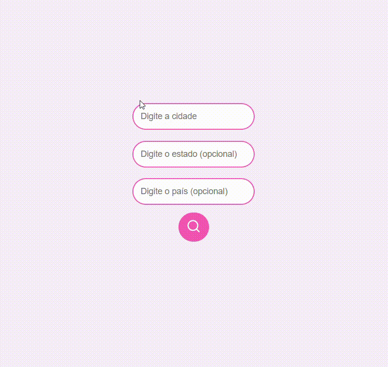
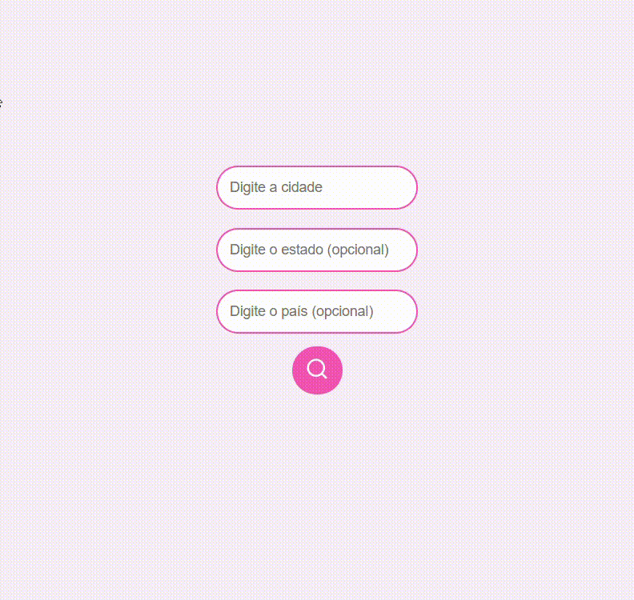
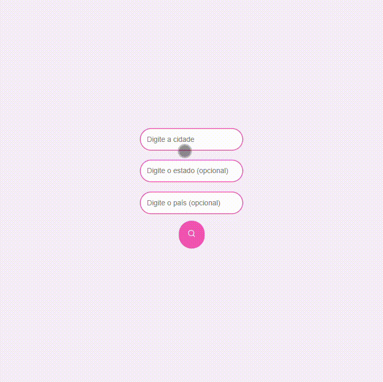

# ☀️ Weather App com React + Typescript

Este é um aplicativo simples para consultar a previsão do tempo usando React.js, TypeScript e a API do OpenWeatherMap. Ele permite ao usuário inserir o nome de uma cidade, estado (opcional) e país (opcional) e visualizar as condições climáticas atuais, como temperatura, descrição e ícone correspondente ao clima.

[](https://weather-app-alicessena.vercel.app/)

## 🚀 Funcionalidades

- **Pesquisar Clima:** O usuário pode digitar o nome da cidade, estado e país para visualizar as condições climáticas.
- **Feedback com Notificações:** O sistema exibe mensagens informando se a busca foi bem-sucedida ou se ocorreu um erro.
- **Indicador de Carregamento:** Exibe um ícone animado enquanto os dados estão sendo recuperados da API.
- **Ícones de Clima:** Exibe ícones relacionados ao clima atual, como sol, chuva, vento, etc.
- **Interface Intuitiva:** Design simples e fácil de usar.

<table border="2">
  <tr>
    <td>
        <h3> Clima com Sucesso </h3>
        <a href=""></a>
    </td>
      <td>
        <h3> Campo de Pesquisa Vazio </h3>
        <a href=""></a>
    </td>
    <td>
      <h3> Erro na Busca </h3>
      <a href=""></a>
    </td>
  </tr>
</table>

## 🛠️ Estrutura do Código

O código está organizado dentro do componente principal `App.tsx`, que gerencia os estados e eventos da aplicação.

### 📌 Estado do Componente

- `weather`: Armazena as informações climáticas retornadas pela API.
- `loading`: Controla a exibição do ícone de carregamento.
- `location`: Armazena o nome da cidade digitado pelo usuário.
- `country`: Armazena o nome do país digitado pelo usuário.
- `state`: Armazena o nome do estado (opcional) digitado pelo usuário.


### 📌 Tecnologias Utilizadas

- React
- TypeScript
- `lucide-react` (ícones)
- API de clima OpenWeatherMap
- `react-toastify` (notificações)

### 📌 Funções Importantes


- **getWeatherFromApi(lat, lon):**  
  - Faz a requisição à API do OpenWeatherMap utilizando as coordenadas de latitude e longitude para buscar as condições climáticas.
  - Exibe notificações de sucesso ou erro.

- **getGeoLocationByName():**  
  - Faz a busca pelas coordenadas (latitude e longitude) com base na cidade, estado e país fornecidos.
  - Chama a função `getWeatherFromApi` para obter as informações climáticas.

- **handleSearch():**  
  - Valida se o campo de cidade não está vazio.
  - Chama a função `getGeoLocationByName` para buscar as coordenadas e, em seguida, as condições climáticas.

- **notify(msg, toastType):**  
  - Utiliza a biblioteca **React Toastify** para exibir mensagens de alerta, informando se a busca foi bem-sucedida ou se ocorreu algum erro.

## 🔍 Como Rodar o Projeto Localmente

1. **Clone o repositório**:
   ```bash
   git clone https://github.com/alicessena/weather-app.git 

2. **Navegue até a pasta do projeto**:
   ```bash
   cd weather-app

3. **Instale as dependências**:
   ```bash
   npm install

4. **Crie uma chave de API da OpenWeatherMap e adicione-a ao arquivo .env**:
   ```bash
   VITE_API_KEY=your_api_key

5. **Inicie o servidor de desenvolvimento:**:
   ```bash
   npm start

